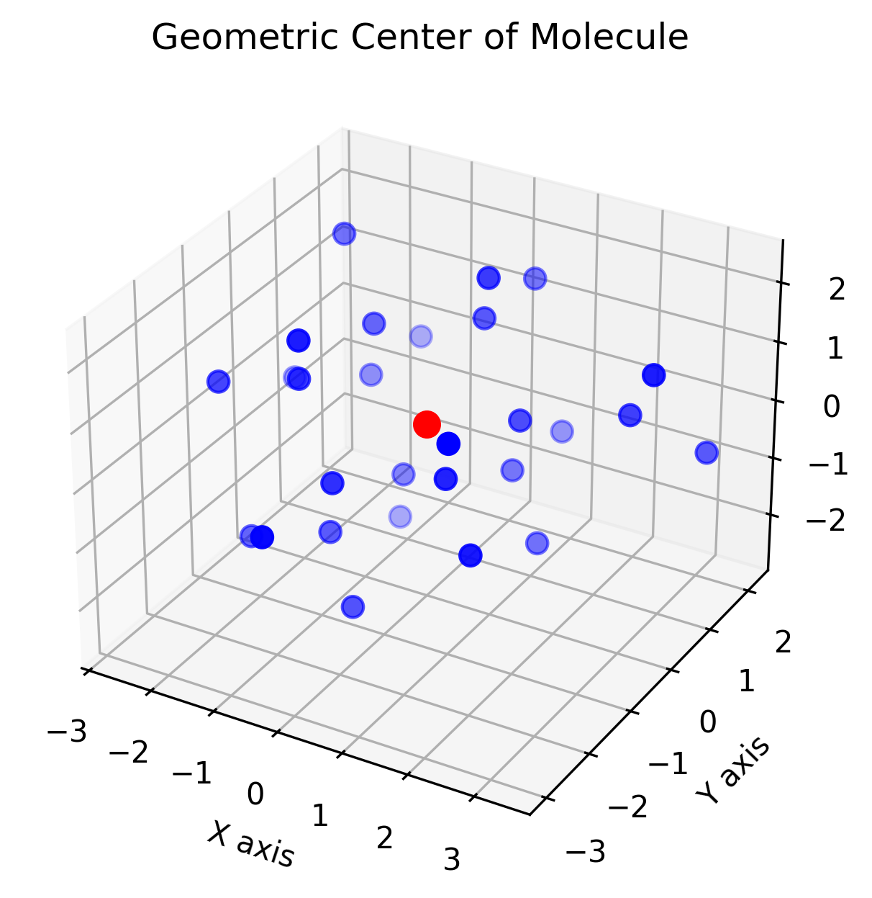

# 💻 Chem 281 Lab 7: Molecules, Templates, Lambdas, OpenMP and Pybind11

## 🧪 Goal

The goal of this lab is to:

1. Familiarize yourself with **representing chemical structures** in a computer.
2. Practice using **C++ templates** and **lambdas**.
3. Learn how to expose C++ functions to **Python using Pybind11**.
4. Work with **3D molecular coordinates** generated from SMILES strings.

---

## 🗂️ Provided

- A `Molecule` C++ class
- Helper functions
- Docker environment with pybind11, rdkit, openmp.
- Python script to create mol files: `scripts/smi_to_mol.py`

---

## 💻 Setup
```bash
./build_image.sh # You may need to chmod +x
./interactive.sh 
```

## ✅ Tasks

### 1. **Generate a `.mol2` file**

Use the provided script to generate `.mol` files:

```bash
python scripts/smi_to_mol.py
```

Then once its made you should have a new directory with all the .mol files `files/mols`. You need to then use openbabel to convert all the mol files into a single .mol2 file. If you change the name of any of these files then the executable based on main.cpp won't be able to find it so you can just update the names then.

```bash
obabel -imol files/mols/*.mol -O files/mols.mol2
```

### 2. **Complete the geometric_centroid() function**
The function should find the centroid of all molecules in the list and must be parallelized with openmp.

$$ {C} = ( \frac{1}{N} \sum_{i=1}^{N} x_i,\ \frac{1}{N} \sum_{i=1}^{N} y_i,\ \frac{1}{N} \sum_{i=1}^{N} z_i ) $$

### 3. **Complete the filter_molecules() function**
You should apply 2 filters to the list of molecules to trim their size down from 80.
    1. Only molecules with atoms <= 25 are allowed.
    2. Only molecules with ALL single bonds are allowed.

These filters are excluding molecules that are too large (lets pretend our active site is really small!), and contains molecules that have a lot of degrees of freedom.

### 4. **Build the executable and library**
Once both steps 2 and 3 are completed you can run the executable `./mol_exe` from the build.
```bash
mkdir build
cd build
cmake -Dpybind11_DIR=/usr/local/lib/python3.10/dist-packages/pybind11/share/cmake/pybind11/ ..
make
```

### 5. **Expose the functions through pybind11 using bindings.cpp**
Add `geometric_centroid()` and `filter_molecules()` as python bindings with the same names.

### 6. **Run the python wrapped functions in test_bindings.py and plot_centroids.py to generate an output figure**
Run the python scripts
```bash
cd scripts
python3 test_bindings.py # You should get 13 molecules after filtering
```

```bash
cd scripts
python3 plot_centroids.py # You should get a figure similar to the one below
```

